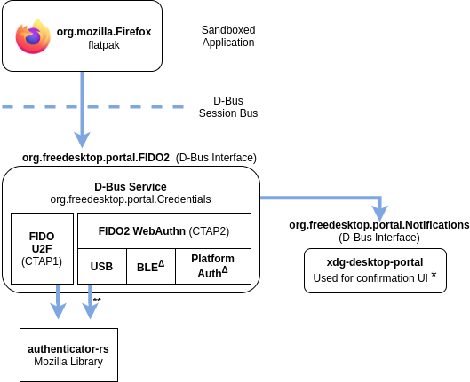

# xdg-credentials-portal

This is a standalone service which aims to offer FIDO2 platform functionality (FIDO U2F, and WebAuthn) on Linux, over a [D-Bus Portal interface][xdg-portal].

The project is composed of multiple crates:

- **libwebauthn**: Linux native implementation of FIDO2 and FIDO U2F Platform APIs.
  - Fully written in Rust.
  - No longer relies on Mozilla's [authenticator-rs][authenticator-rs].
  - Supporting multiple transports (currently USB HID and BLE). The library is designed to have pluggable transport implementations, making it easy to add transport backends (planned: NFC, caBLEv2).
- **xdg-credentials-portal**: API proposal and reference implementation for a service which will expose FIDO2 and FIDO U2F Platform APIs via a D-Bus interface, for desktop applications to use - including conteinerized apps such as Flatpaks.
  - Similarly to [xdg-desktop-portal][xdg-desktop-portal] and [xdg-documents-portal][xdg-documents-portal], the service is intended to be accessed over a proposed D-Bus _portal_: [org.freedesktop.portal.Credentials][xml-spec].

## libwebauthn

### Transports

|                      | USB (HID)                 | Bluetooth Low Energy (BLE)  | NFC                   | TPM 2.0 (Platform)    |
| -------------------- | ------------------------- | --------------------------- | --------------------- | --------------------- |
| **FIDO U2F**         | 🟢 Supported (via hidapi) | 🟢 Supported (via bluez)   | 🟠 Planned ([#5](#5)) | 🟠 Planned ([#4][#4]) |
| **WebAuthn (FIDO2)** | 🟢 Supported (via hidapi) | 🟠 Planned ([#3](#3))      | 🟠 Planned ([#5](#5)) | 🟠 Planned ([#4][#4]) |

### Platform functionality

- FIDO U2F
  - 🟢 Registration (U2F_REGISTER)
  - 🟢 Authentication (U2F_AUTHENTICATE)
  - 🟢 Version (U2F_VERSION)
- FIDO2
  - 🟢 Create credential
  - 🟢 Verify assertion
  - 🟢 Biometric user verification
  - 🟢 Discoverable credentials (resident keys)
- FIDO2 to FIDO U2F downgrade
  - 🟢 Basic functionality
  - 🟢 Support for excludeList and pre-flight requests
- PIN/UV Protocols
  - 🟢 PIN/UV Auth Protocol One
  - 🟢 PIN/UV Auth Protocol Two
- PIN/UV Operations
  - 🟢 GetPinToken
  - 🟢 GetPinUvAuthTokenUsingPinWithPermissions
  - 🟢 GetPinUvAuthTokenUsingUvWithPermissions

## xdg-credential-platform

This is a very early stage idea, no proposed spec exists yet.

Here is an high-level architecture diagram of the proposed service and how it will interact with its clients:

Footnotes:

- **\***: Better alternatives for UI should be considered, e.g. native UI implementations via xdg-credentials-portal-{gnome, kde}.
- **Δ**: See Roadmap section below

### Motivation

- **Sandboxed Browsers**. A modern solutions is required to allow sandboxed applications (Flatpaks, Snaps) to access U2F and FIDO2 devices, without granting blanket access to all devices.

  - Firefox has now officially been [released on Flathub][firefox-flathub], but is unable to access U2F devices. See [flatpak issue #2764][flatpak-issue]

- **Passwordless Authentication**. FIDO2/WebAuthn brings the promise of a world without passwords, and related security incidents, which is worth pursuing. A platform API would make it easier for applications to support stronger authentication.

- **Platform Authenticators** are an important part of the FIDO2 specification, and fundamental for widespread adoption of passwordless authentication. Windows Hello, [Android's FIDO2 support][fido-android], Apple's TouchID and FaceID, are all examples of platform authenticators. There is no reason why the Linux desktop community could not enjoy similar benefits

  - [Passwordless Web Authentication Support via Windows Hello - Mozilla Security Blog][firefox-hello]
  - [Your Google Android 7+ Phone Is Now a FIDO2 Security Key - Fido Alliance][fido-android]

- **Native Apps FIDO2 Support**. FIDO2 should not be segregated to web applications.
  - [FIDO2 API for Android][fido-android-api] (native apps)

### Other platforms

Here is a list of related APIs available on other platforms, which offer similar functionality:

- **Android SDK**: [Fido2ApiClient][android-fido-unprivileged]
- **Windows Hello**: [FIDO2 Win32 APIs][windows-hello-api]
- **macOS, iOS**: WebAuthn via [ASWebAuthenticationSession][apple-apis]

Further references:

- [D-Bus API Design Guidelines][dbus-api-guidelines]
- Relevant FIDO2 specifications:
  - **[CTAP 2.0 Proposed Standard][ctap2]**
    - [Section 7: Interoperating with CTAP1/U2F authenticators][ctap2-interop]
    - [CTAP 2.1 Review Draft][ctap21]
  - [W3C - Web Authentication API][webauthn]

## Contributing

If you'd like to contribute but you don't know where to start, take a look at available tasks in the _Issues_ tab.

Alternatively, any investigation or expertise on the following would be very helpful. Please reach out!

- **Platform Authenticator support**. Similarly to Android devices, and Windows Hello. In order to implement this (and request FIDO2 certification), support for the following is needed:

  - Trusted Platform Modules (TPMs)
  - User-verification devices (e.g. fingerprint readers)

- **Unprivileged access**. FIDO2 credentials are scoped to an _origin_ (e.g. `https://example.org`). The proposed API allows applications to specify any origin (as needed by browsers). Hence, it requires an additional user confirmation step for security purposes. This extra step may not be needed if the request sender could be verified, as the legitimate _owner_ of the specified origin.

  - As an example, Android has implemented two APIs: [Fido2ApiClient][android-fido-unprivileged] (unprivileged), and [Fido2PrivilegedApiClient][android-fido-privileged] (privileged) for use by web browsers. The main difference between the two is that the privileged API allows specifying an arbitrary _origin_, whilst the unprivileged API requires [linking your app to your origin][android-fido-unprivileged-cert].

- **PAM, and passwordless login** (long-term goal). A PAM module would allow using FIDO2 for user login purposes, e.g. using the platform authenticator (similar to Windows Hello).

- **D-Bus Portal API design**

- **Proposal and contribution processes (Flatpak, GNOME, etc.)**

- **UI/UX**

[xdg-portal]: https://flatpak.github.io/xdg-desktop-portal/portal-docs.html
[xdg-desktop-portal]: https://github.com/flatpak/xdg-desktop-portal
[xdg-documents-portal]: https://github.com/flatpak/xdg-desktop-portal/tree/master/document-portal
[xml-spec]: ./data/org.freedesktop.portal.FIDO2.xml
[authenticator-rs]: https://github.com/mozilla/authenticator-rs
[authenticator-rs-ctap2]: https://github.com/mozilla/authenticator-rs/tree/ctap2
[windows-hello-api]: https://github.com/Microsoft/webauthn
[dbus-api-guidelines]: https://dbus.freedesktop.org/doc/dbus-api-design.html
[ctap2]: https://fidoalliance.org/specs/fido-v2.0-ps-20190130/fido-client-to-authenticator-protocol-v2.0-ps-20190130.html
[ctap2-interop]: https://fidoalliance.org/specs/fido-v2.0-ps-20190130/fido-client-to-authenticator-protocol-v2.0-ps-20190130.html#u2f-interoperability
[ctap21]: https://fidoalliance.org/specs/fido2/fido-client-to-authenticator-protocol-v2.1-rd-20191217.html
[webauthn]: https://www.w3.org/TR/webauthn/
[firefox-hello]: https://blog.mozilla.org/security/2019/03/19/passwordless-web-authentication-support-via-windows-hello/
[flatpak-issue]: https://github.com/flatpak/flatpak/issues/2764
[firefox-flathub]: https://flathub.org/apps/details/org.mozilla.firefox
[fido-android]: https://fidoalliance.org/news-your-google-android-7-phone-is-now-a-fido2-security-key/
[fido-android-api]: https://developers.google.com/identity/fido/android/native-apps
[android-fido-unprivileged]: https://developers.google.com/android/reference/com/google/android/gms/fido/fido2/Fido2ApiClient
[android-fido-unprivileged-cert]: https://developers.google.com/identity/fido/android/native-apps#interoperability_with_your_website
[android-fido-privileged]: https://developers.google.com/android/reference/com/google/android/gms/fido/fido2/Fido2PrivilegedApiClient
[apple-apis]: https://developer.apple.com/documentation/authenticationservices/aswebauthenticationsession
[#10]: https://github.com/AlfioEmanueleFresta/xdg-credentials-portal/issues/10
[#3]: https://github.com/AlfioEmanueleFresta/xdg-credentials-portal/issues/3
[#4]: https://github.com/AlfioEmanueleFresta/xdg-credentials-portal/issues/4
[#5]: https://github.com/AlfioEmanueleFresta/xdg-credentials-portal/issues/5
[#17]: https://github.com/AlfioEmanueleFresta/xdg-credentials-portal/issues/17
[#18]: https://github.com/AlfioEmanueleFresta/xdg-credentials-portal/issues/18
